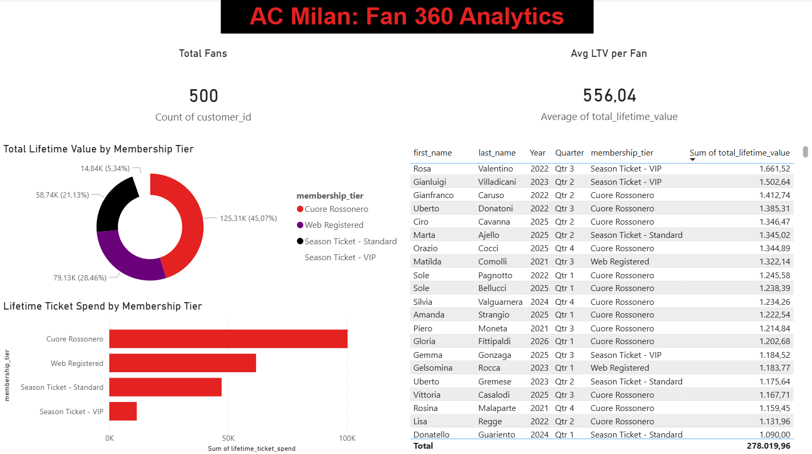

# AC Milan Data Engineering Platform (Fan 360)

## Overview
An end-to-end modern ELT (Extract, Load, Transform) data pipeline simulating AC Milan's Customer, Ticketing, and eCommerce data. This project extracts synthetic data, loads it into a localized **SQL Server Data Lake**, and transforms it into business-ready Fan 360 models using **dbt (Data Build Tool)**.

## Architecture & Tech Stack
* **Python**: Used the `Faker` and `pandas` libraries to generate and ingest 3 streams of mock business data.
* **Microsoft SQL Server (Docker)**: Containerized data warehouse acting as our landing zone.
* **dbt (Data Build Tool)**: Orchestrated the staging and mart transformations using standard software engineering practices (version control, DRY principles).
* **Power BI**: Connected directly to the SQL Server database to visualize the lifetime value of different membership tiers.

## Project Structure
- `/generate_data.py`: The Python data generator and ingestion engine.
- `/docker-compose.yml`: Infrastructure-as-code to spin up the local SQL Server instance.
- `/sportlake_dbt/`: The full dbt project containing raw sources, staging models, and the final `mart_customer_value` table.
- `ac_milan_fan_360.pbix`: The interactive Power BI dashboard file.

## Step-by-Step Implementation

### Step 1: Infrastructure Setup
* **SQL Server**: Deployed a containerized Microsoft SQL Server 2022 instance via Docker Compose, exposing port `1433` locally.
* **Environment**: Created a local Python virtual environment, managing dependencies with `requirements.txt` (`dbt-sqlserver`, `pandas`, `faker`, `sqlalchemy`, `pyodbc`).

### Step 2: Data Generation & Ingestion (Extract & Load)
* Scripted a synthetic data generator (`generate_data.py`) utilizing Python's `Faker` library with an `it_IT` locus to mock realistic Italian fan data.
* Orchestrated the generation of 3 core entities: `Customers` (CRM context), `Ticketing` (stadium match-day sales), and `eCommerce` (merchandising).
* Utilized `pandas` alongside the modern **Microsoft ODBC Driver 17** to safely load the DataFrames directly into a `raw` schema within SQL Server.

### Step 3: Data Modeling & Transformation (dbt)
* Initialized a fresh dbt core project, configuring the `profiles.yml` for local SQL auth.
* **Staging Layer**: Built initial models (`stg_customers`, `stg_ecommerce`, `stg_ticketing`) to handle type-casting, specifically ensuring string dates were rigorously cast to native SQL `DATE` objects.
* **Mart Layer**: Engineered the final business logic view (`mart_customer_value`), utilizing massive aggregates and outer joins to calculate the total lifetime spend of a single fan across both tickets and merchandising datasets.

### Step 4: Data Visualization (Power BI)
* Connected Microsoft Power BI natively to the `127.0.0.1` Docker instance.
* Selected the final transformed dbt mart to serve as the unified semantic model.
* Designed a clean, executive AC Milan themed (Red/Black) dashboard highlighting core KPIs such as Total Fans, Average Lifetime Value (LTV), and Revenue Segmentations by Membership Tier.